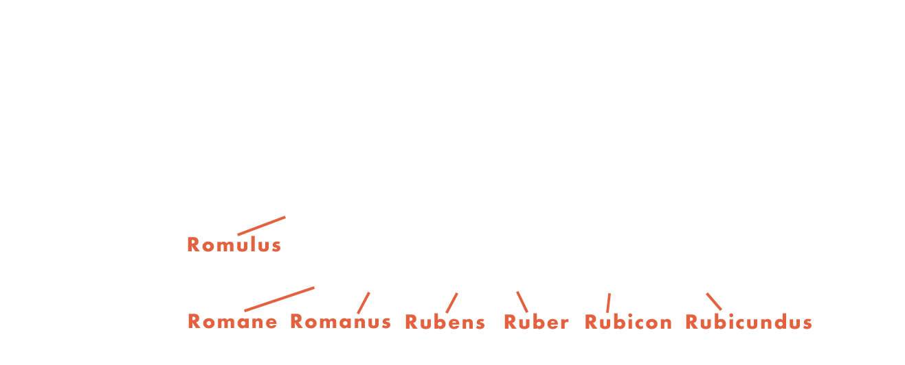

# Suggest Service / Prefix tree

Let's imagine that every time a user starts typing a query, our system starts "searching" through all the records in your database to find relevant variants (even using binary search!). It's as if every time we search for one particular book in a huge library, we would start browsing each shelf first, hoping to find the right volume. Not only would this take a lot of time, but it could also cause excessive load on the server.

Now imagine your database consists of tens of millions of queries. A direct binary search over that much data may take a few seconds, which seems like an instant for the scale of such a database, but in reality it is infinitely long for a user who expects a responsive interface, seamless UX and hence instantaneous system response. Moreover, this approach would be resource-intensive, increasing the cost of maintaining servers.

That's why a simple search (even if the queries are sorted, which would allow binary search) is still not an effective solution. We need a tool that allows us to instantly find relevant queries without having to look through each one. What if we pre-prepare a data structure that takes into account the user's typing structure and logic when formulating a query?

Well, welcome to the world of prefix trees!

## Prefix trees

A prefix tree or simply Trie is a tree-like data structure used to store a dynamic set of strings (we will also call them queries). Each node represents a single character, and strings are formed by tracing a path from the root of the tree to a particular node. This allows us to quickly find all matching queries starting with a given prefix, without having to "search" the entire database.

A prefix is a part of a word that starts with the first letter and ends with any of the following letters. For example, the prefixes of the word "computer" are "k", "ko", "com", "comp" and so on.

The suffix of a word is the part of the word that begins with any of the letters of the word and ends with the last letter.

In the Trie context, knowing the prefix of a word, it is possible to find all its suffixes stored in the tree.

This is accomplished by "descending" from the last character of the prefix down the tree. Thus, the prefix "ap" can lead us to the suffixes "i" or "ple" if both of these words are stored in the tree.

The main advantages of prefix trees:

Speed - they allow us to quickly retrieve strings with a common prefix. For example, if a user starts typing "com", our tree can quickly show sentences such as "computer", "compact" and "company".
Memory efficiency - the tree may seem wasteful in terms of memory, but its structure ensures that common prefixes are only stored once. This results in significant memory savings, especially for large datasets.
Dynamism - trie can be updated. This means that as new search queries become popularized, we can seamlessly integrate them into our existing tree.
Autocomplete - this is the backbone of our hinting service. As users enter their queries, trees can predict and suggest the most likely completions.

## Relevance evaluation
If you represent a user query as a prefix, it's not hard to get the right suffixes.

But how to sort them and select the top-k queries for a user?

To solve this problem, we use a ranking system based on the popularity of queries. Each query in our tree is assigned a certain weight (a positive value). The more often users search for a certain query, the higher its weight. It is by this weight that we rank the hints (you can learn more about the ranking metrics in the NDCG task), offering first the ones most frequently searched by other users.

In addition, thanks to the flexibility of prefix trees, we can integrate machine learning-based weights, further improving the relevance and accuracy of our hints.

##Reverse tree
At first glance, prefix trees look perfect for providing quick hints based on the initial characters of the user's input. However, what if the user searches using part of a word or phrase that is in the middle or even at the end?

A Reversed Trie is a prefix tree in which strings are added in reverse order. Thus, it allows you to efficiently find prefixes for a given suffix or, in other words, it improves substring search.

## Autocomplete Suggestions Formatting

The formatting of autocomplete suggestions is a crucial aspect of the user experience and typically begins with a Trie or a Reversed Trie to generate the basic suggestions. However, to enhance the quality and relevance of these suggestions, additional techniques are employed.

### Suggestion Methods

Here are some of the methods from our project's code that shape the user's search query:

1. `suggest_query`: The primary method that generates suggestions based on the user's input.
2. `suggest_removed_char`: A method that removes the last character from the query and provides suggestions for the modified query.
3. `suggest_last_words`: This method offers suggestions based on the prefixes of the last words of the query.
4. `suggest_each_word`: In this method, suggestions are regenerated for each word in the query independently.

After applying these methods, a comprehensive list of potential suggestions is formed. All collected suggestions are sorted according to their relevance.
In the end, the user is presented with the most suitable suggestion.

## Start service

Run command:

`bash run.sh`.

## Tests

Run command:

`pytest .`.

Run with detailed output (errors and prints):

`pytest -svv .`.

Run a single test (if you want to test a specific function):

`pytest -svv tests/test_app.py::test_suggestions_recall`.

## Pylint

Run command:

`pylint app.py`.
